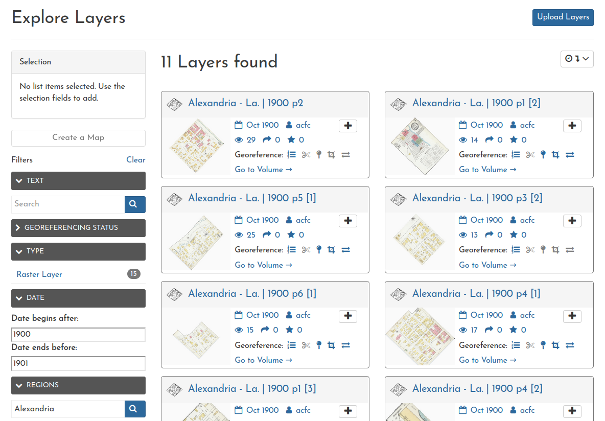
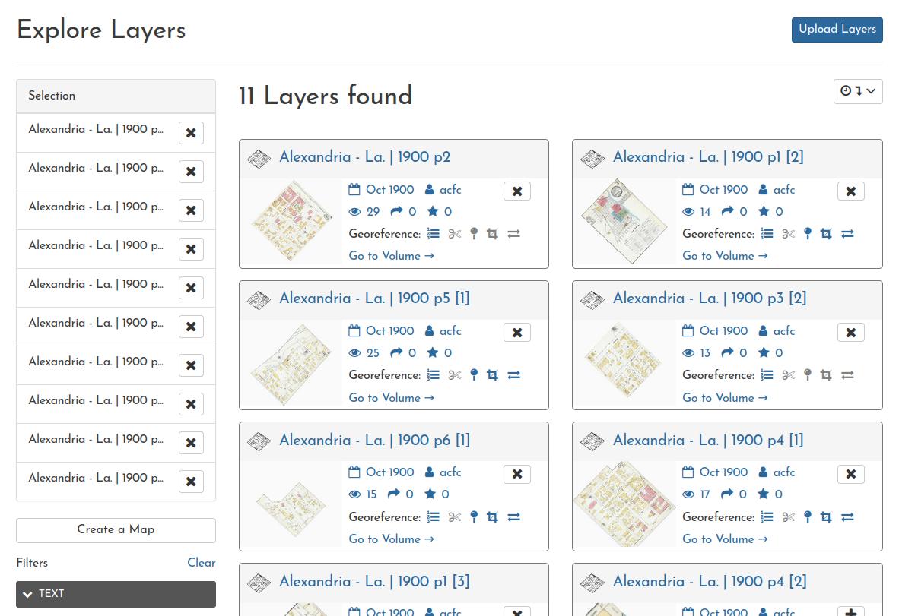
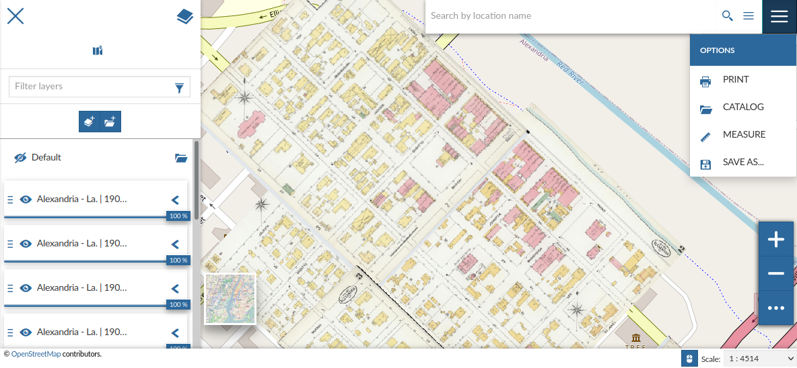

# Alexandria, La. | 1900

!!! note
    This tutorial is still in development.

This tutorial will walk through the entire process using the maps of [Alexandria, Louisiana from 1900](https://www.loc.gov/resource/g4014am.g032671900/?st=gallery) as an example.

The complete workflow is:

1. [Load the Volume](#loading-a-volume)
2. [Prepare the Documents](#prepare-the-documents)
3. [Georeference the prepared Documents](#georeference-the-prepared-documents)
5. [Create a Web Map from the Layers](#create-a-web-map-from-the-layers)
4. [Trim some of the Layers](#trim-some-of-the-layers)

The end result is a web map which can be <a href="https://oldinsurancemaps.net/maps/203/view" target="_blank">viewed in the site</a> or embedded with an `<iframe>` on any web page as show below. Also, any of the individual layers can be used in other web maps or geospatial software (as WMS).

<figure>
    <iframe height="400px;" style="max-width:700px; width:100%;" src="https://oldinsurancemaps.net/maps/203/embed"></iframe>
    <figcaption>Alexandria, Louisiana in 1900. <a href="https://oldinsurancemaps.net/maps/203" target="_blank">web map detail</a></figcaption>
</figure>

Keep in mind that these steps are designed to facilitate a collaborative and iterative environment. While you *could* complete an entire volume in one session, you can also just do individual steps here and there, allowing others to fill in around.

Also, georeferencing and trimming (3 & 5 above) are both iterative processes, so you can come back later to improve upon your own work, or someone else's.

# Load the Volume

From the [Volumes page]("https://oldinsurancemaps.net"), we begin by finding the city and year we are interested in.

!!! todo
    [image of Alexandria volumes]

Selecting the 1900 volume, we can either preview the contents in the Library of Congress IIIF viewer, or click **Load Sheets** to begin the georeferencing process.

!!! todo
    [show image with one sheet loaded]

As the sheets load, they are registered in the system as Documents. You can click the refresh button (or reload the page) and newly loaded sheets will appear. After one sheet is ready, we can go ahead and prepare it. The other sheets will continue to load in the background.

# Prepare the Documents

On Sanborn maps, different parts of a town were often combined into the same map sheet in order to save space. This is easy to recognize because a thick black line was always used to delinate these areas. Consider the image below, the sheet 1 of Alexandria, 1900.

!!! todo
    [image of the splitting interface with sheet 1]

In this case, there are 4 different sections. In the splitting interface, you will draw lines across the map document to determine how it will be split. Notice that the lines don't have to start or end exactly at the border; they can extend beyond. The yellow preview shows the shape of the new parts that will be made.

!!! todo
    [image with all lines made]

Click **Split** and you will be brought to the progress overview page for this Document. Once the splitting has completed, you'll see all four new pieces.

Now we'll return to the Volume overview page. Use your browser's Back button, or go to the top nav menu **Content > Volumes** and select the volume from the list.

!!! todo
    [image of the volume with sheet 1 prepared]

The "unprepared" sheet 1 has been turned into four "prepared" documents.

### *But what if the sheet doesn't need to be split?*

We'll now prepare sheet 3.

!!! todo
    [splitting interface with sheet 3]

As you can see, there are no thick black lines dividing this map up; it does not need to be split. Simply click **No Split Needed** to mark this document as "prepared".

# Georeference the Prepared Documents

Back in the volume summary, there is now 1 unprepared sheet, and 5 prepared Documents.

!!! todo
    ...

# Create a Web Map from the Layers

Once most of the documents have been georeferenced, you can create a web map to combine them into a mosaic.

Go to the search page, and use the search facets to find the appropriate layers. In this case, we'll use:

- **Regions**: `Alexandria`
- **Date begins after**: `1900`
- **Date ends before**: `1901`

This will return all of the layers we have georeferenced so far.

With the layers narrowed down, select each one with the <i class="fa fa-plus"></i> button, and then click "Create a Map"

You will be brought to a new web map. You can arrange the layer order as needed. Make sure you Save As and give the map a descriptive title before leaving the page!

If more documents are georeferenced after you have already made this map, use the **Catalog** to find and add those layers to this map.

# Trim Some of the Layers

!!! todo
    ...